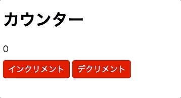

# レポジトリ内容

この課題は、Web白熱教室のReact課題その3「[【エクササイズ】カウンター機能を持つReactコンポーネントを実装する](https://tsuyopon.xyz/learning-contents/web-dev/javascript/react/js-exercise-for-react-3/)」の課題レポジトリになります。

## 課題

- 以下の完成形の画像と同じ見た目になるように実装する
- 具体的な実装の流れは、以下の「課題をクリアするためのステップ」の内容を参考にすること

## 完成形

### 課題をクリアするためのステップ

- [ ] srcディレクトリの中に `components` ディレクトリを作成する
- [ ] `components` ディレクトリの中に `Button` ディレクトリと `Counter` ディレクトリを作成する
- [ ] `Button` ディレクトリの内容は「[【エクササイズ】Reactの2種類のコンポーネントとpropsを使う](https://tsuyopon.xyz/learning-contents/web-dev/javascript/react/js-exercise-for-react-2/)」で実装したものと同じものとする
- [ ] `Counter` ディレクトリの中に `Counter.jsx` というファイルを作成して、クラスコンポーネントで作る
- [ ] `Counter.jsx` は以下の次の内容を持つ
    - [ ] stateを持ち、countプロパティを持つ (= `this.state.count` を持つ)
    - [ ] `increment` メソッドと `decrement` メソッドを持ち、それぞれのメソッドでは次の機能を持つ
        - incrementメソッド : this.state.countの値を1増やす(= インクリメントする)
        - decrementメソッド : this.state.countの値を1減らす(= デクリメントする)
    - [ ] インクリメントボタンとデクリメントボタンを表示する(詳しくは上の完成形の画像を参考にすることｖ)
        - それぞれのボタンを `Button` コンポーネントを使って実装する
        - インクリメントボタンをクリックしたら `increment` メソッドを実行する
        - デクリメントボタンをクリックしたら `decrement` メソッドを実行する
- [ ] `npm start` を実行して、上に貼った「完成形」と同じ見ための表示がされれば完了

## レビュー依頼時の注意

- このプルリクをフォークして作業を開始しても構わないし、自分で `create-react-app` を使ってゼロから環境を作りあげるでも良い。
    - このプルリクをフォークして作業を開始して、最終的にレビューを依頼するときは以下の動画を参考にすること
        - [【動画解説】学習コンテンツの課題に取り組むときの注意点](https://tsuyopon.xyz/learning-contents/github/when-you-try-the-excercise-of-learning-contents/)
    - 自分で `create-react-app` を使ってゼロから環境を作ったものをレビューに投げる時は以下の動画を参考にしてプルリクを作成すること
        - [【動画解説】GitHubにレポジトリをPushするまでの流れ](https://tsuyopon.xyz/learning-contents/github/how-to-push-a-local-repository-to-the-github/)
        - [【動画解説】GitHubでプルリクエストを作るまでの流れ](https://tsuyopon.xyz/learning-contents/github/how-to-create-a-pull-request-on-github/)
- 一般的な開発フローに慣れるために、[git flow](https://qiita.com/KosukeSone/items/514dd24828b485c69a05)で作業を進めることをオススメする
    - masterブランチからdevelopブランチを作成する
    - developブランチからfeatureブランチを作成する
    - featureブランチで作業をして、プルリクエストを作成するときは、developブランチにマージされるように作成する

## 参考記事

課題をこなしていて、行き詰まったら以下の資料を参考にしていただければ解答にたどり着けるかと思います。

- Web白熱教室
    - [【React】コンポーネントのstateの使い方を理解する](https://tsuyopon.xyz/learning-contents/web-dev/javascript/react/understand-and-how-to-use-the-state/)
    - [【React】コンポーネントのライフサイクルを理解する【ライフサイクル図付き】](https://tsuyopon.xyz/learning-contents/web-dev/javascript/react/understand-the-lifecycle-of-components/)
    - [【React】コンポーネントにクリックイベントを実装する](https://tsuyopon.xyz/learning-contents/web-dev/javascript/react/how-to-handle-click-events/)
- プルリクエスト(`git flow` の開発スタイルで機能毎にブランチを分けて実装を進める際に参考になるページ)
    - https://github.com/tsuyopon-xyz/api_server_with_mock_db/pulls?q=is%3Apr+is%3Aclosed
